# Adversarial Attacks
A project and dissertation topic by Samuel Smith, supervised by Robin Nandi and Tom Schofield.
The objective of the dissertation is to train an object detection model to detect and localise objects in a drone video, and then train a patch to fool these models into misclassifying an object. We will print out the patch and analyse how it performs in real-life in a large scale basis.
The adversarial patch is a frightening addition to the collection of adversarial attacks which can really affect a model's predictions. The patch could even be printed as a small sticker, and then placed on a road sign as in [Inconspicuous Adversarial Patches for Fooling Image Recognition Systems on Mobile Devices](https://arxiv.org/pdf/2106.15202.pdf). In my case, the focus is on building a patch which can easily fool an image classification model. When it comes to fooling an object detection model however, there have been less successful results now that there is an aspect of localising an object in the pipeline; the patch is reported to be ignored by the Faster R-CNN model as in [D-Patch](https://arxiv.org/pdf/1806.02299.pdf).

As can be seen in the code displayed in this repository, I am focused on building an image classification model as close to the object detection model as possible, and then investigating the generalisable qualities of this patch, i.e. if it will affect the object detection model's predictions.

# Contents
1. [Installation](#installation)
2. [Usage](#usage)
3. [Notebook Contents](#notebookcontents)
    a. [model_testingOBJDET Part 1](#model_testingOBJDETpart1)
    b. [model_testingOBJDET Part 2](#model_testingOBJDETpart2)
    c. [model_testingOBJDET Part 3](#model_testingOBJDETpart3)
    d. [IMGCLASS_withPATCH](#imgclass_withpatch)
    e. [SORTING_imgclassdata](#sorting_imgclassdata)
4. [Unique Files](#uniquefiles)
    a. [obj_detectionMODEL](#obj_detectionfiles)
    b. [img_classificationMODEL](#img_classificationfiles)
5. [Results of models](#modelresults)
    a. [Object Detection model](#objectdetectionresults)
    b. [Patch results](#patchresults)
6. [Credits](#credits)

# 1. Installation/Application
The Tensorflow object detection module is imported via a special command in [model_testingOBJDET](model_testingOBJDET.ipynb), and then a verification script is run to check if the correct version of the module is imported. The datasets on which I trained the two models on are also available within the repository.

# 2. Usage
This project can be used as a guidance for building an accurate object detection model on Google Colab, with code based on the very helpful [Tensorflow Object Detection Tutorial](https://www.youtube.com/watch?v=yqkISICHH-U) by Nicholas Renotte. The user could train a model with my manually annotated dataset, or use their own, or they could increase the amount of training steps, use a different model etc. The notebooks model_testingOBJDET are carefully annotated to help the user understand what each cell is doing.

 I have included the patches in the image classification folder, so these patches can be tested in other environments.

# 3. Contents for each .ipynb notebook in the repository

**a. model_testingOBJDET Part 1:**
The preamble of the notebook is setting the different folders in your drive folder, in which the many processes will occur, such as where the model zoo Github repository     is cloned into, where the model checkpoints are saved etc.
 ***Image Moving and Preparation*** - Some functions I personally had to create so that all my training images coexist in the same folder, and the same for my test images.
 ***Download TF Models Pretrained Models from Tensorflow Model Zoo and Install TFOD*** - The first three cells in this section are possibly the most important. You **CANNOT** run this object detection model script without making sure the VERIFICATION_SCRIPT runs perfectly as well, with OK (skipped=1) being the desired output at the end. 
 This allows you to run `import object_detection` without a problem.
 ***Backup Folder Announcement*** - Hugely important notice to the model trainers out there: make some backups of any folders you consider important. It is tricky to deal with image files, especially when there are also corresponding .xml files for each image file.
 ***Create Label Map*** - After checking all the .xml files have assigned image files and vice versa, this code will define the label map for the model to predict each class with. Please make sure the label names for each class are consistent across your entire workspace e.g. they aren't lowercase during the annotation stage.

 **b. model_testingOBJDET Part 2:**
 ***Create TFRecords*** - The TFRecords are ways of storing the annotation data for each image as binary data. The code originally had to be changed as sometimes the .xml files had inconsistent manners of storing values i.e. sometimes ymax and xmax's order were swapped in the object class.
 ***Configure pipeline*** - Here we can configure the hyper-parameters of the model. You can do this by setting them in a code cell, or going into the pipeline.config file and editing it there.
 ***XML Files Debugging*** - This section is included for when I was collecting annotated datasets, and there was some .xml dubious files that I thought was at fault for the errors in training. It ended up being that the TFRecords inconsistency was at fault.
 **IMPORTANT:** Check CONVERTING ORIGINAL SET OF IMAGES in Part 3 below for information on removing alpha channels from .png image files. The TFRecord format only accepts images with three colour channels, without the extra alpha channel which accounts for transparent images.
 ***Model Training*** - Finally, we have the model training section. Here, you can choose the amount of training steps.
 ***Reflection of pre-processing and finally getting model to train*** - Short reflection of the steps I had to take to make the model work, which could also serve as a Common Problems section.

 **c. model_testingOBJDET Part 3:**
 ***Converting Original Set Of Images*** As mentioned above, the alpha channel must be removed as an extra channel, where only RGB should be left as the three accepted channels.
 ***Second Backup Warning***
 ***Model Evaluation*** - This script will test the model's saved metrics gathered during the training process, such as its accuracy, recall and precision. It's not especially clear to me why the accuracy is reported to be so bad by these values, as can be seen later on that the model fares well with unseen scenery. The error could result from difficult classes to localise, such as 'vegetation' where the big collections of trees can be difficult to localise and group together.
 ***Showcasing the Detection on an Image*** -  The model is called to predict objects in a scene. The image can be from the test set, or as I have edited the code to show, from a personally chosen image from Google or from a contributor.
 ***Evaluation*** - These values show the metrics for my first few object detection models trained with some internet-sourced datasets. They were insufficient in every way, and soon resulted in having to personally collect images and annotate them all myself.
 The rest of Part 3 deals with some old degraded methods to fix the accuracy of the model, when all I needed to do was start again with a personally chosen and smaller image/annotation dataset.

 **d. IMGCLASS_withPATCH.ipynb**
  ***Loading the Image Datasets*** - Finding the mean and standard deviation values for my training set. However, this is for the method of normalising according to a mean and standard deviation value, which is not used in this instance.
 ***Training the model*** - Now that I have pre-processed the data in a similar way to my obj detection pipeline, to be precise the pixel value normalisation stage, I can move on with training a MobileNet V2 pre-trained model, which is also used as the feature extractor in the obj detection pipeline. (The values must be resized however, and 320 x 320 appears to be a good size for the model to at least recognise features well).
 ***Saving and Loading the models*** - When later creating a patch, it is vital to save the model using <model.state_dict()>, as the full model save using <torch.save(model)> is insufficient.
 ***Patch functions*** - This section creates patches of a set size, and is well annotated to explain each cell's contribution to the final product.
 ***Testing Screenshots from Drone Footage*** - This part of the notebook tests the patch's attempt at inducing misclassification, and prints the image with the top three predictions.

 **e. SORTING_imgclassdata.ipynb**
 This folder firstly removes the alpha channel from images, as they usually appears when using Google Images as a source, and then in ***Cropping for image classification model***, the .xml files are parsed: the co-ordinates are used to extract the objects within them and place them in a folder based on their class name, which is also available within the .xml file data.

4. ***Unique files***

 ***a. Object Detection Model Files:***
 ***ckpt-6.data-00000-of-00001*** & ***ckpt-6.index*** are both checkpoint files for the final pre-trained object detection model, which is used for the rest of the project.
 ***label_map.pbtxt*** is the label map that the Tensorflow API uses in training.
 ***pipeline (2).config*** is my pipeline with changed hyper-parameters to achieve a higher accuracy.
 ***train.record*** and ***test.record*** are binary records of the image and .xml file data, which are necessary for the training process to minimise RAM usage.

 ***b. Image Classification Model Files:***
 ***earlystopping_mobilenetv2_model.pth*** is the capture of the state of the trained model which I used for the remainder of the project. It should be loaded like this: 
`# Load the model in case of the CPU environment it was loaded in needing specifying
num_classes = 7
model = models.mobilenet_v2(pretrained=False)
model.classifier = nn.Sequential(
    nn.Linear(1280, num_classes)
)
checkpoint_path = '/content/drive/MyDrive/IMGCLASSmodels/models/earlystopping_mobilenetv2_model.pth'
model.load_state_dict(torch.load(checkpoint_path))
# Set the model to evaluation mode
model.eval()`
 ***"""_patch.pt*** files are the patches stored as .pt files.

***5. Model Results***

Below are some of the object detection model's predictions:
.png)
.png)
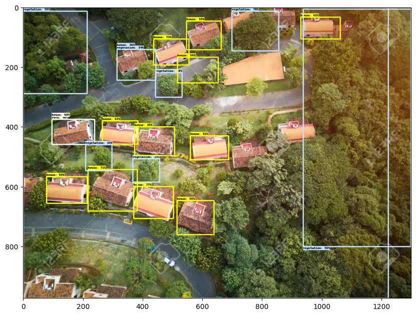
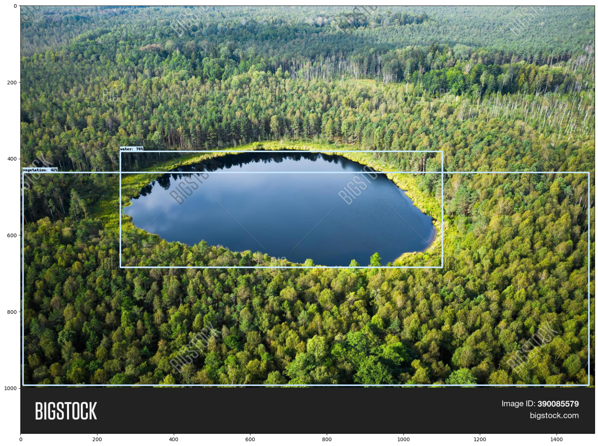
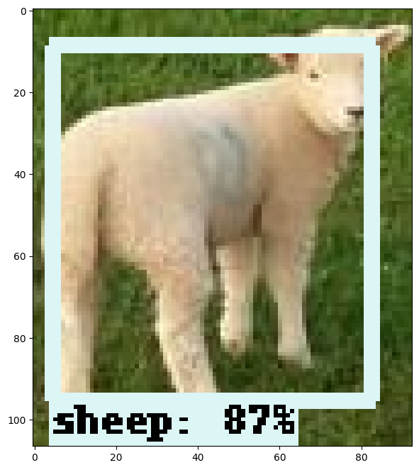
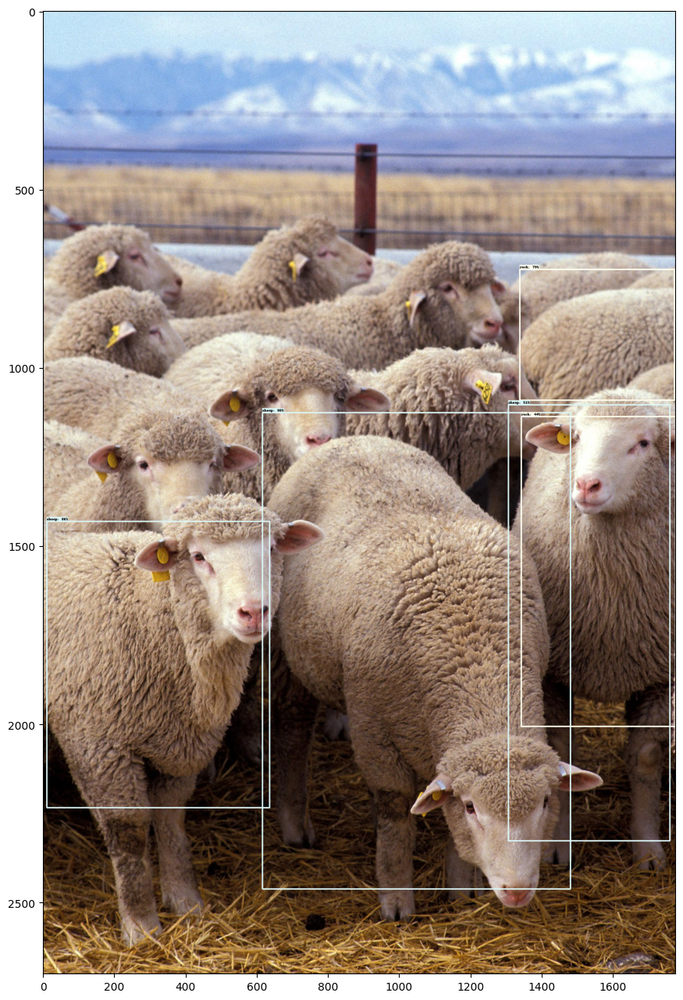
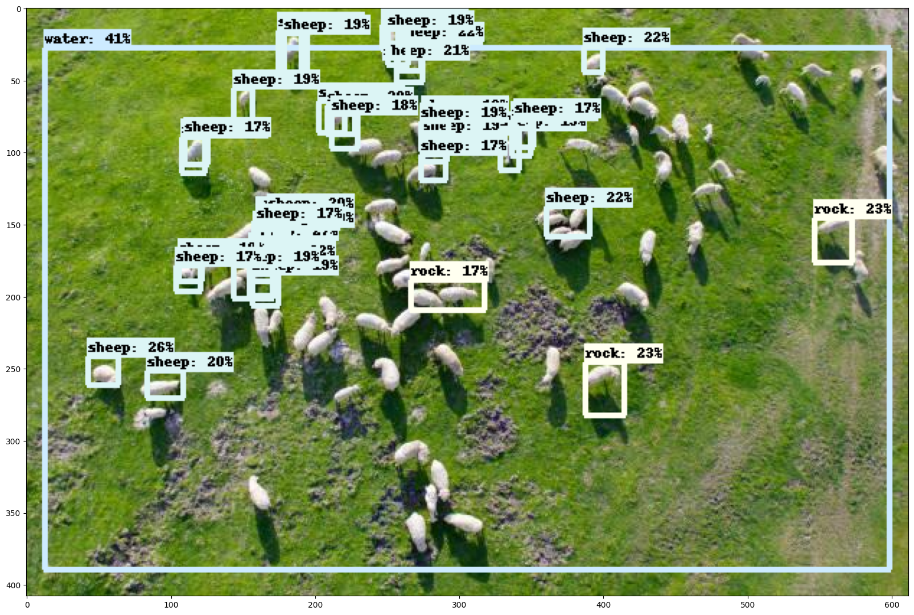
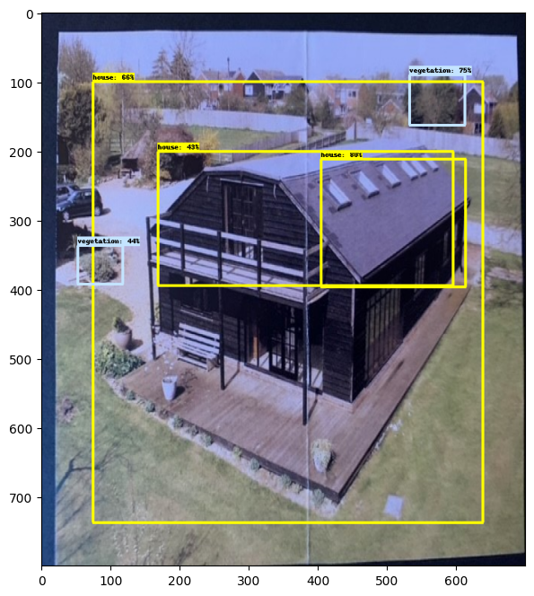
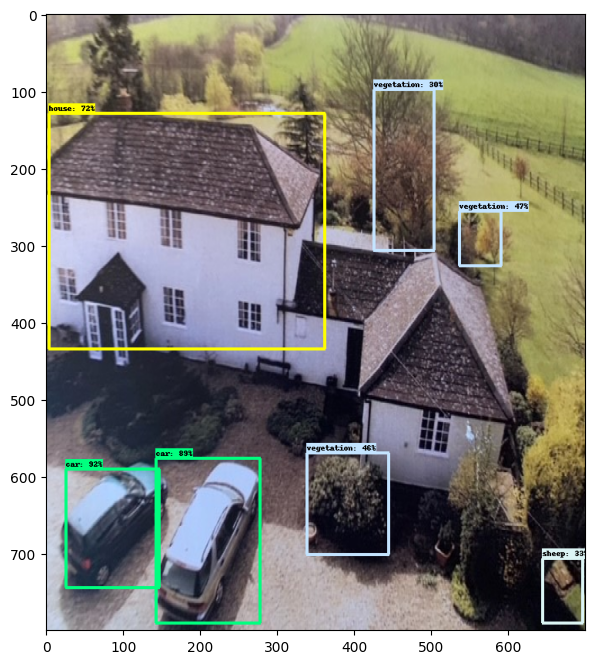
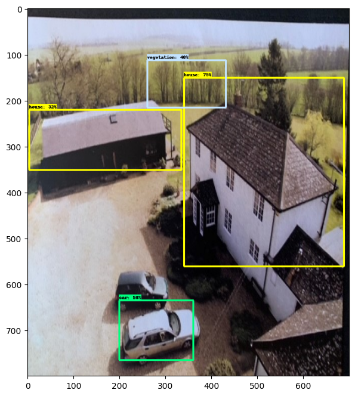

Below are the patch predictions for the image classification model:
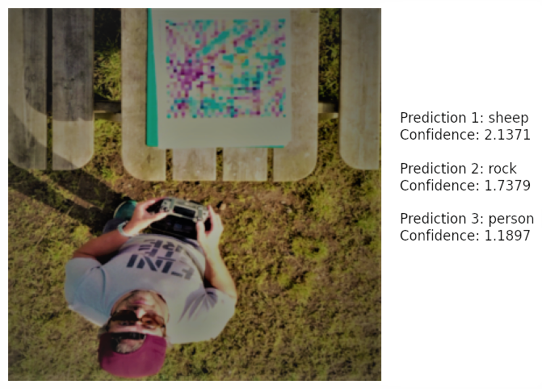
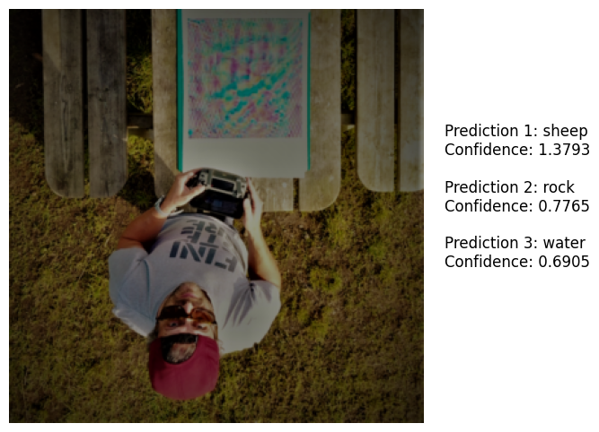
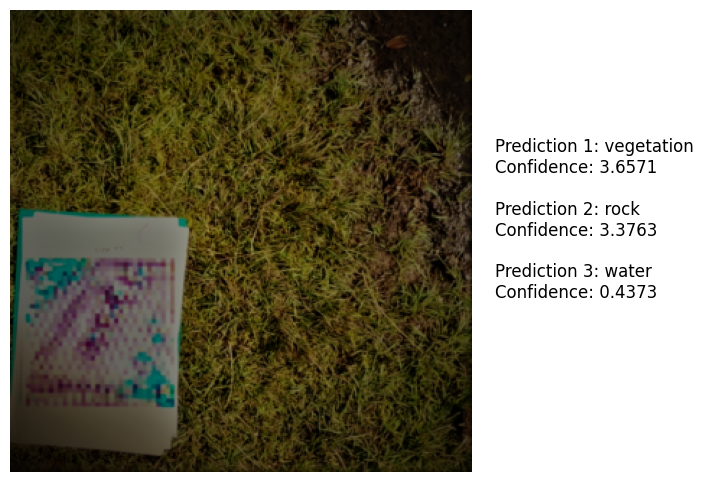
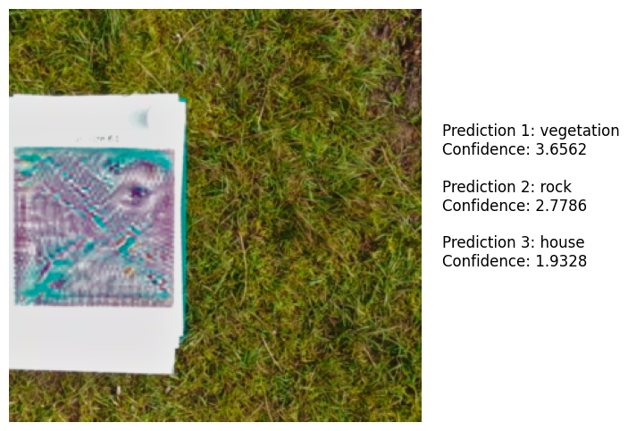
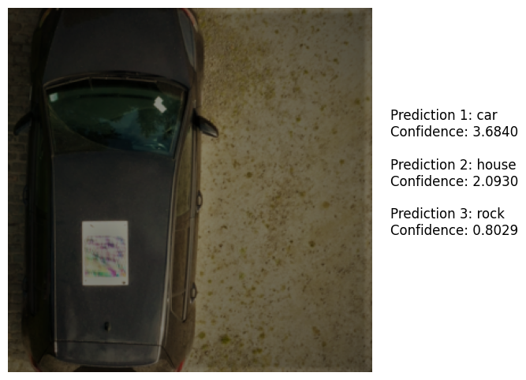
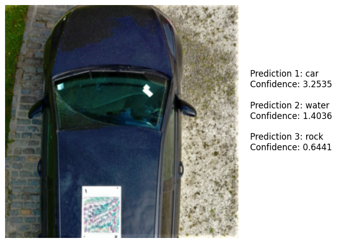
The patches are largely ignored by the image classification model, apart from the sheep patch.
Below are the predictions for the object detection model:
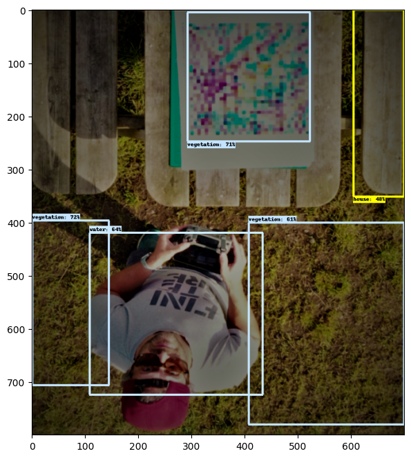
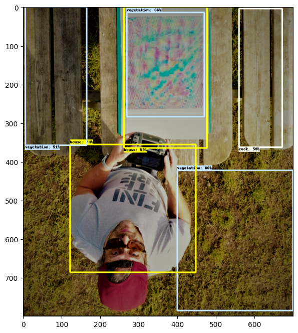
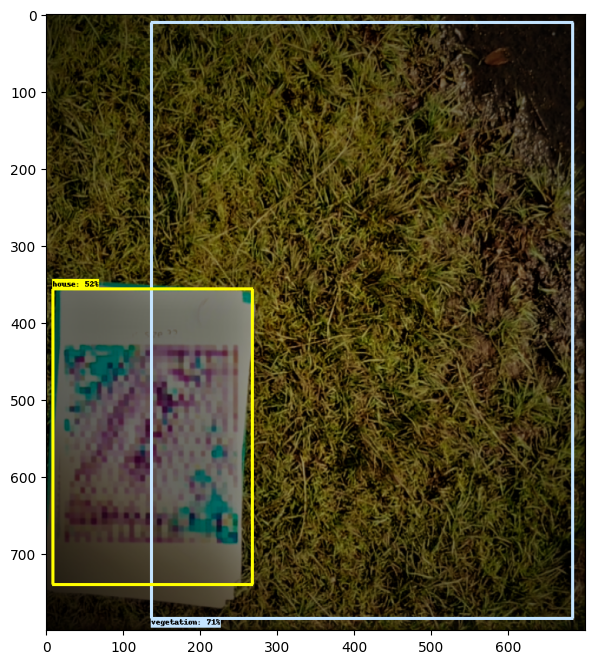
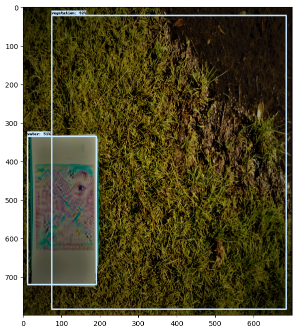
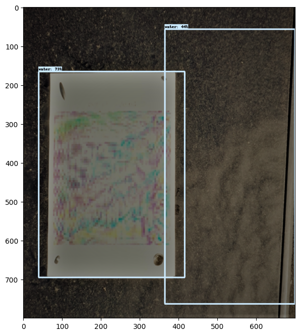

# Credits
Thanks to Robin Nandi for his help with teaching me about Github.
Thanks to Tom Schofield, for his help with printing out the patches and filming the footage with his drone.
Many thanks to Megan Porter, for assisting me in providing some images to test the object detection model with, and also helping me through some stressful and mind-boggling times.
